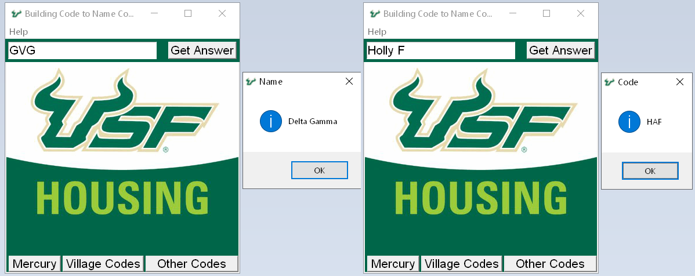

# USF-Building-Codes
This is a little program I made that makes it easier for desk clerks to find the names from building codes. 
For example, MAF is Magnolia F. But for some of them they are more difficult, especially the Greek ones, which means clerks have to go through the list manually to look for the building code, and then find the matching name. 
This program lets you input the three digit code (case-insensitive) and it will output the building name for you. 
I plan on making it look nicer and adding a few more features, but the basics are there already. 

