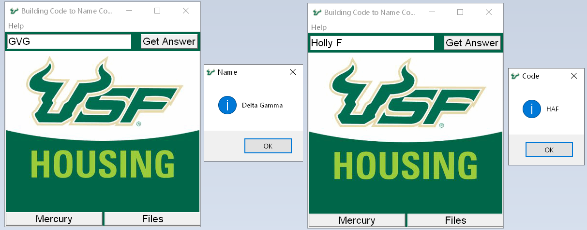

# USF Housing Dashboard GUI
This is a little program I made that makes it easier for desk clerks to find the names from building codes and vice versa. 
For example, HAG is Holly G. But for some of them they are more difficult, especially the Greek ones, which means clerks have to go through the list manually to look for the building code, and then find the matching name. 

This program lets you input the three digit code or building name (both case-insensitive) and it will output the building name or code for you. It also has useful links for desk clerks.

